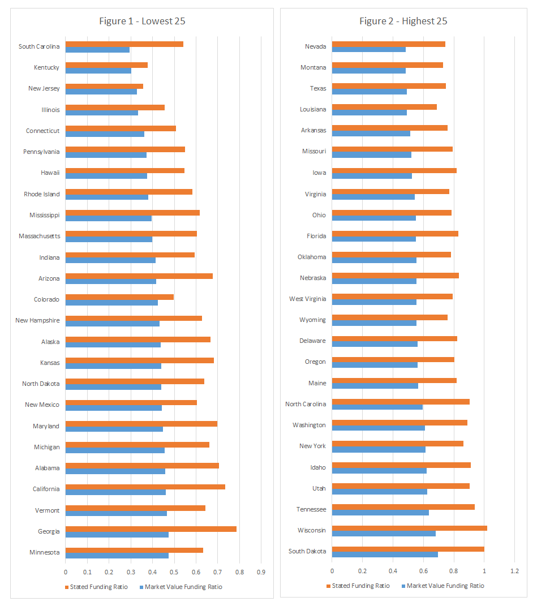
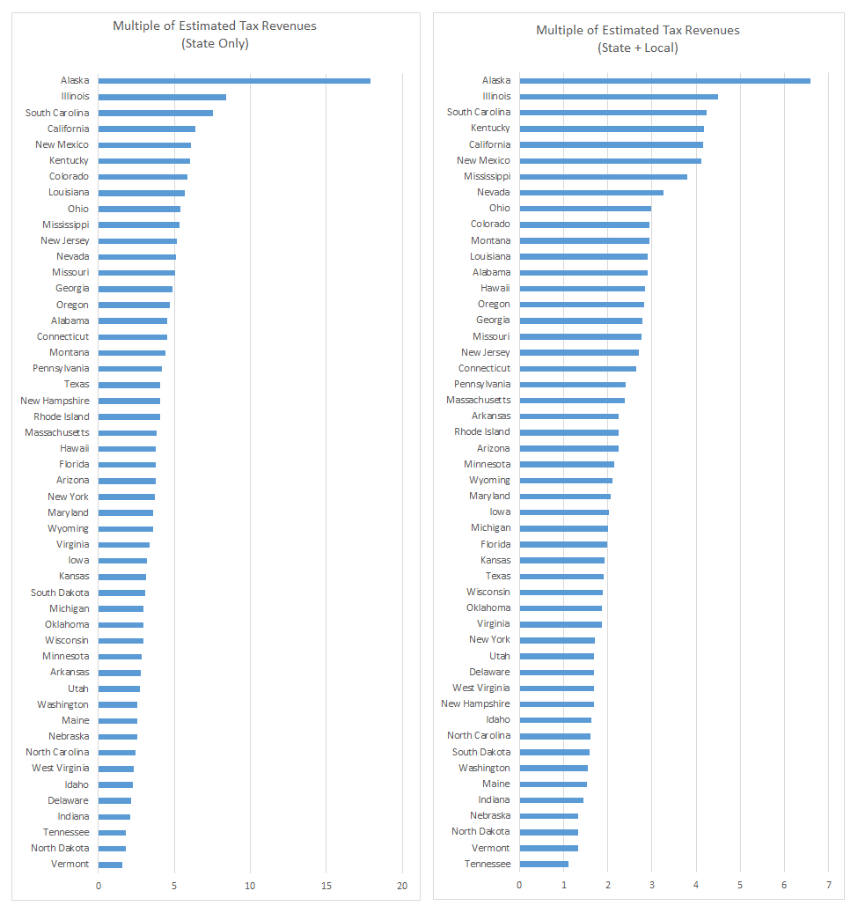
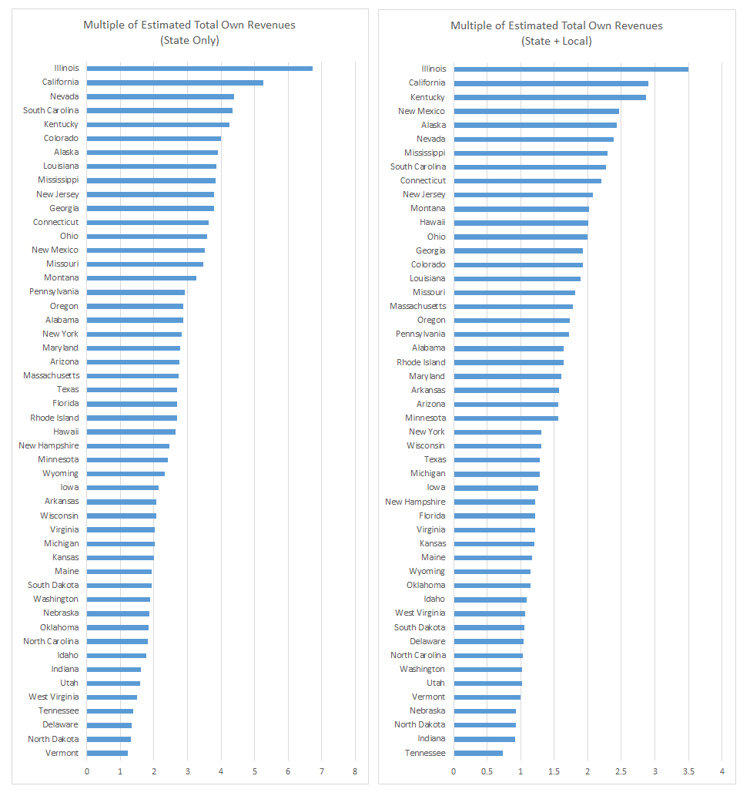
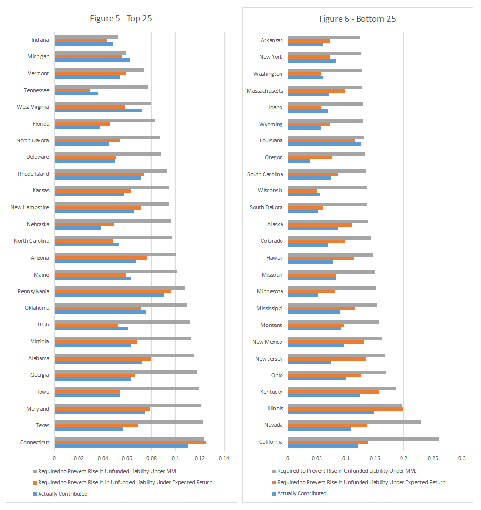
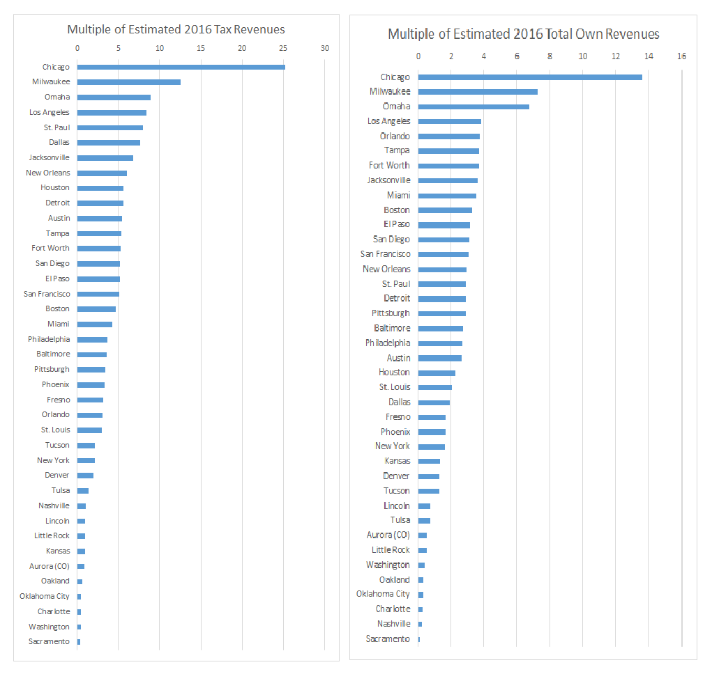
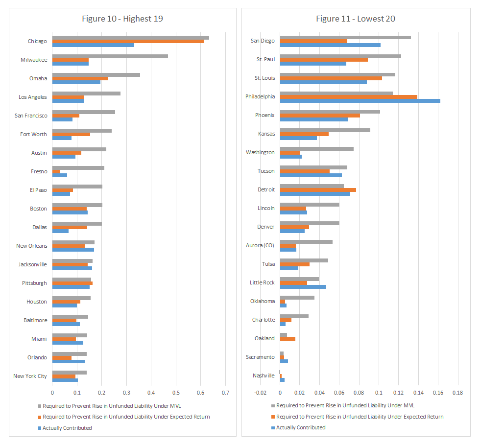
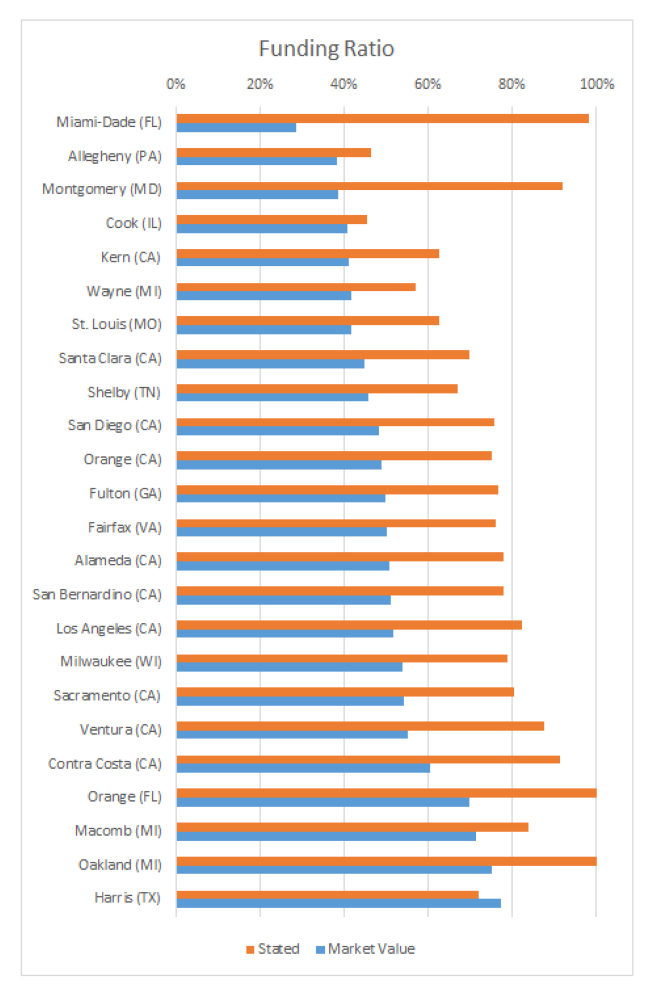
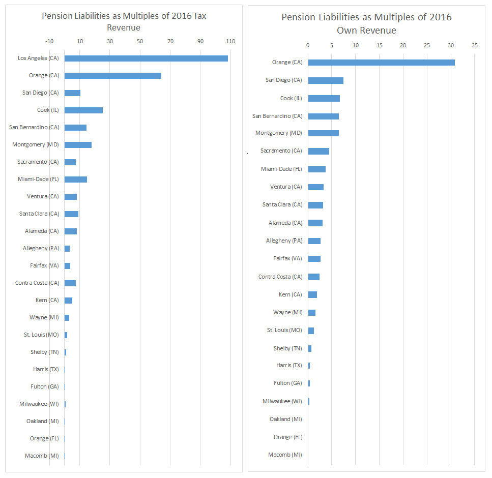
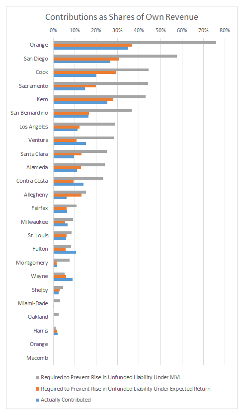

**Figures 1 & 2: Funding Ratios by State**

Figure 1 shows these funding ratios for the twenty-five states with the lowest percentages in 2016, while Figure 2 shows the twenty-five states with the highest. These statistics are for state-sponsored funds only. Market-valuation funding ratios vary widely and run from a minimum of just 29.5% in South Carolina to a maximum of 70% in South Dakota. The difference in stated funding ratios and those calculated using the risk-neutral market value approach is also often significant. For example, South Dakota’s stated funding ratio is 100%, leading one to believe that it is completley funded. However, its market value funding ratio is only 69.6%.

**Figure 3: Multiple of Estimated Tax Revenues**

**Figure 4: Multiple of Estimated Total Own State Revenues**

Figure 3 examines unfunded liabilities as multiples of estimated tax revenue at both the state and local levels.  On the left side of the figure, the first graph includes all fifty states ranked by the multiples of state-only tax revenue.  On the right side of the figure, the second graph also includes all fifty states; however, here they are ranked by the multiples of state and local tax revenue.  Figure 4 utilizes the same bifurcation between graphs; however, instead of having the multiples estimated based upon total tax revenues, the multiples are estimated using total own state-only revenues and total own revenues on the state and local levels.   Multiples of tax revenues in both graphs range extensively.  For example, when focusing on the multiples of state-only tax revenue, Alaska’s is over seventeen while Vermont’s multiple is just over one.  While Alaska’s extreme multiple is in part caused by the effect that petroleum price shocks had on the state’s revenue, high multiples are seen in other states as well.  Illinois and South Carolina, with the second and third highest multiples respectively, both have unfunded liabilities over seven times their estimated state-only tax revenues. 

**Figures 5 & 6: Percentage of State Revenues Contributed**

The next analysis examines the flow, or “pension deficit”—how much new unfunded liabilities are accrued each year under the different measurement techniques. Figures 5 and 6 show the share of own revenue actually contributed to pension systems in each state, as well as the share required to be contributed to avoid an increase in the unfunded liability. Figure 5 shows the twenty-five states with highest required shares while Figure 6 shows the twentyfive states with the lowest.

These figures illustrate large differences between the amounts actually contributed and the amounts necessary to contribute to avoid rises in unfunded liabilities. In many states, GASB NPL increases even under the assumption of expected return—that is, the bottom bar is larger than the top bar. In all states except Michigan, the contributions required to keep the UMVL from increasing outstrip those actually made, and in many cases substantially so. 

In other states, one sees even more troubling statistics. For example, in Nevada contributions
were 10.8% of own revenue in 2016. Even if Nevada had reached its assumed rate of return, the state would have had to contribute 13.9% of own revenue in order to prevent a rise in the NPL. Under the MVL approach, the pension budget would be balanced (in the sense of non-increasing debt) if Nevada had contributed 22.9% of own revenue, well over twice of what it actually contributed. None of these calculations include any amounts to pay down unfunded liabilities.

States for which the pension deficit under the UMVL measure is close to the pension deficit under the expected return measure are generally those for which the present value of newly accrued benefits is relatively small compared to the size of the interest cost, which is a function of the unfunded liability. These states fall into two categories. First, there are states that have undertaken pension reforms, which typically slow the rate of future growth rather than reduce accrued liabilities. Second, there are states where interest costs are high relative to service costs because of the large extent of unfunded liabilities.

For example, Rhode Island requires 7.4% of own revenue under the expected return measure but 9.3% of own revenue under the MVL measure, a relatively small difference. This is because Rhode Island undertook a major pension reform in 2011 that reduced benefit accruals substantially by introducing a hybrid element to its pension
system. For service beyond that date, employees’ pensions would grow at a slower rate; in addition, they receive contributions to a defined contribution plan. As a result, service costs for Rhode Island are small relative to interest costs.

Connecticut and Louisiana also show a relatively small difference between the pension deficit measures, but this rather reflects the fact that the pension systems in these states have very poor funding ratios. The return on assets in these states therefore has a less important impact because there are comparatively few assets to begin with.

**Figures 7 & 8: Stated and Market Value City Funding Ratios**

Figure 7 shows the twenty cities with the lowest funding ratios in 2015, while Figure 8 shows the twenty cities with the highest ratios. Similarly to the states’ ratios, cities’ MVL funding ratios vary widely, from just 22.9% in Chicago to a maximum of 74.5% in Fresno, California. Large differences in stated and market value are again prevalent as well. For example, Fresno’s stated funding ratio is 112%.

**Figure 9: Pension Debt as a Multiple of Own Revenue and Tax Revenue**

Figure 9 shows the pension debt (NPL and UMVL) as a multiple of own revenue and tax revenue, in descending order of the latter. Among top-forty US cities by population, Chicago’s pension liabilities were the largest multiple of 2015 revenue, at 13.6 times own source revenue and 25.2 times tax revenue. Milwaukee, Omaha, Los Angeles, and Orlando are the other cities in the top five according to UMVL as a share of total own revenue, surpassing multiples of 3.7. Milwaukee, Omaha, Los Angeles, and St. Paul are the other cities in the top five according to UMVL as a share of tax revenue, surpassing mutlipes of 8.0 times total tax revenue.

**Figure 10 & 11: Percentage of City Revenues Contributed**

Figures 10 and 11 show the pension deficits. The City of Chicago contributed 33.2% of its own revenue to pensions in 2016; but to prevent a rise in the UMVL (that is, to run a balanced pension budget on a market-value accrual basis), it would have had to contribute a full 63.3% of its own revenue. Milwaukee, Omaha, Los Angeles, and San Francisco would all have had to contribute more than 25.3% of their budgets just to prevent the UMVL from rising.

As was the case for states, cities that have undertaken pension reforms to slow the growth of
new pension benefits show smaller differences between the pension deficit under the MVL and the pension deficit under the expected return measures, as service costs will be small relative to interest costs. One example is Philadelphia, which introduced a new hybrid plan
and requires employees who do not elect to participate to contribute more to the plan. As a 
result, the city only needs to contribute 11.4% of own revenue to prevent increases in unfunded liabilities, despite the fact that its unfunded legacy liability is quite large.

Another factor that generates differences in the extent to which the UMVL pension deficit exceeds the expected-return deficit is the choice of the expected return itself. Systems that already assume a lower rate will have less distance between the measures. Some examples include the Portland, Oregon, Fire & Police Disability & Retirement Fund and the legacy systems of the city of Indianapolis, which use discount rates that are not far from Treasury rates due to their very low funding ratios. However, since the Indianapolis systems have long been closed to new workers, the pension deficits for the city overall are small relative to the city’s resources.

**Figure 12: Funding Ratios by County**

Figure 12 shows the twenty-five counties’ funding ratios, ranging from a minimum of 28.6% in Miami-Dade County, Florida, to a maximum of 77.2% in Harris County, Texas. 

**Figure 13: Multiple of Estimated 2016 Total Own State Revenues**

Figure 13 shows pension debt as a multiple of own revenue and tax revenue, in descending order of the latter. Los Angeles, California, had the largest multiple, at 55.03 times own source revenue and 108.3 times tax revenue. Orange County, California, San Diego, California, and Cook County, Illinois  are the three counties with the next highest multiples, and all three surpass multiples of six times total own revenue and ten times total tax revenue.

**Figure 14: Percentage of County Revenues Contributed**

Figure 14 shows the counties’ pension deficits. Orange County, California, contributed 34.9% of its own revenue to pensions in 2016, but under MVL it would have had to contribute 75.9% to prevent a rise in unfunded liability. Cook County, Illinois, and three counties in California—Sacramento, San Diego, and Kern—also would have had to contribute more than 40% of their own revenue budgets just to prevent the UMVL from rising.

<style type="text/css">

body{ /* Normal  */
      font-family: Helvetica;
      font-size: 11px;
  }
td {  /* Table  */
  font-size: 8px;
  color: Gray;
}
h1.title {
  font-size: 20px;
  color: Teal;
}
